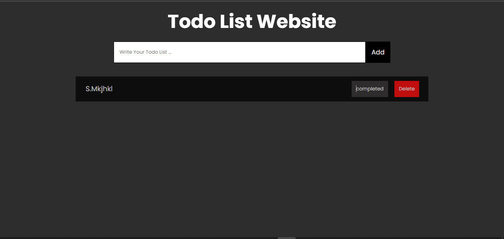

<h1>Todo Using TypeScript</h1>

<ol>
<h2>Todo List Features</h2>
<li>Add Task and check that todo not empty</li>
<li>click Completed when complete task</li>
<li>Delete Task when you want to remove it</li>
<li>Save Tasks in localStorage</li>
</ol>

<ol>
<h2>Todo List Technologies</h2>
<li>HTML</li>
<li>CSS - SCSS</li>
<li>TypeScript</li>
<li>JavaScript</li>
</ol>
